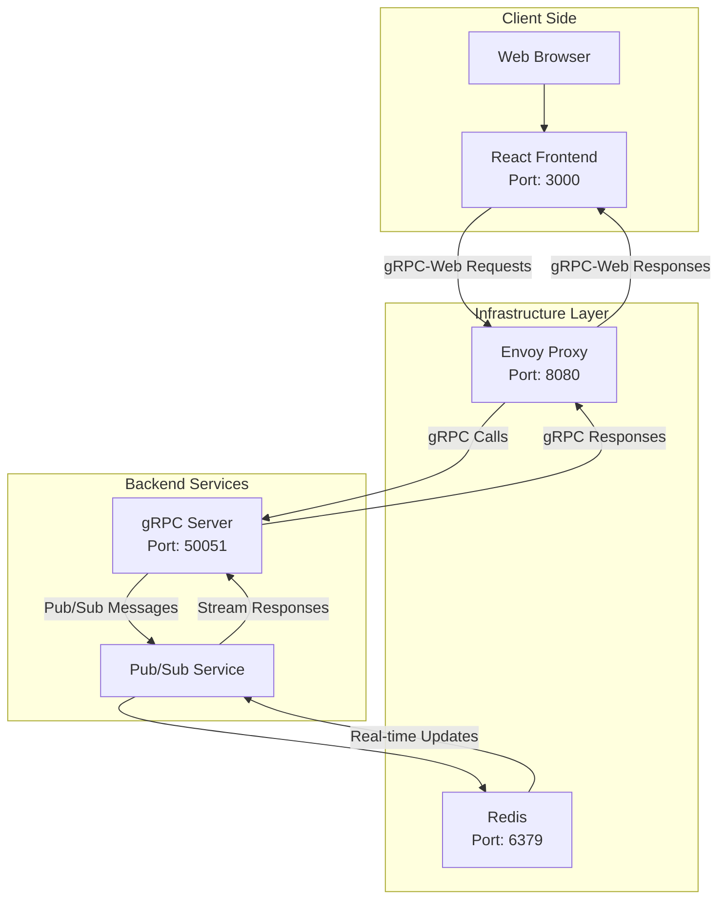

# React-gRPC Chat Application

A real-time chat application built with React frontend, Node.js gRPC backend, and Redis for pub/sub messaging. The application demonstrates modern web technologies including gRPC-Web for browser-server communication and streaming for real-time features. **Unlike traditional chat applications that rely on WebSockets, this project uses gRPC streaming for efficient, type-safe real-time communication.**

## 🚀 Tech Stack

### Frontend

- **React** (v19.1.0) - UI framework
- **TypeScript** - Type safety
- **Material-UI (MUI)** - Component library for modern UI
- **gRPC-Web** - Client-side gRPC implementation for browsers
- **Google Protobuf** - Protocol buffer support

### Backend

- **Node.js** with **TypeScript** - Server runtime
- **gRPC** (@grpc/grpc-js) - High-performance RPC framework
- **Redis** - In-memory data store for pub/sub messaging
- **Protocol Buffers** - Efficient serialization format

### Infrastructure

- **Docker & Docker Compose** - Containerization
- **Envoy Proxy** - gRPC-Web proxy for browser compatibility
- **Redis** (Bitnami image) - Message broker

## 📁 Project Structure

```
React-grpc chatapp/
├── backend/                 # Node.js gRPC server
│   ├── proto/              # Protocol buffer definitions
│   │   ├── random.proto    # Chat service definitions
│   │   └── randomPackage/  # Generated TypeScript files
│   ├── server.ts           # Main gRPC server
│   ├── pubsub.ts          # Redis pub/sub implementation
│   ├── data.ts            # Data management
│   ├── docker-compose.yml # Infrastructure setup
│   └── envoy.yaml         # Envoy proxy configuration
├── frontend/               # React application
│   ├── src/
│   │   ├── components/    # React components
│   │   │   ├── Chat.tsx   # Main chat component
│   │   │   ├── ChatBubble.tsx
│   │   │   ├── UserList.tsx
│   │   │   └── Greeting.tsx
│   │   └── proto/         # Generated gRPC-Web files
│   └── public/           # Static assets
└── README.md            # This file
```

## 🛠 Features

- **Real-time messaging** - Instant message delivery using gRPC streaming (no WebSockets required)
- **User management** - User registration and avatar support
- **Live user list** - See who's currently online
- **Modern UI** - Clean, responsive interface with Material-UI
- **Type safety** - Full TypeScript support across frontend and backend
- **Scalable architecture** - gRPC for efficient client-server communication
- **Advanced streaming** - Bidirectional gRPC streams for real-time updates

## 📸 Screenshots

### Login page


### Chat pages


## 📋 Prerequisites

Before running this application, make sure you have installed:

- **Node.js** (v16 or higher)
- **npm** or **yarn**
- **Docker** and **Docker Compose**
  - **Windows**: Install Docker Desktop from https://www.docker.com/products/docker-desktop/
    - Requires WSL 2 (Windows Subsystem for Linux) to be installed and enabled
    - Enable WSL 2 integration in Docker Desktop settings
    - **Make sure Docker Desktop is running** before starting the application
  - **macOS**: Install Docker Desktop from https://www.docker.com/products/docker-desktop/
  - **Linux**: Install Docker Engine and Docker Compose via package manager
- **Git**
- **Protocol Buffers Compiler (protoc)** - Required for generating gRPC files
  - Download from: https://github.com/protocolbuffers/protobuf/releases
  - Or install via package manager:
    - Windows: `choco install protoc` (using Chocolatey)
    - macOS: `brew install protobuf`
    - Linux: `sudo apt-get install protobuf-compiler` (Ubuntu/Debian)
- **Protocol Buffer Plugins** - Required for JavaScript and gRPC-Web generation:
  ```bash
  # Install globally using npm
  npm install -g protoc-gen-js
  npm install -g protoc-gen-grpc-web
  ```

## 🚀 Getting Started

### 1. Clone the Repository

```bash
git clone https://github.com/A-KGeorge/grpc-realtime-chat.git
cd React-grpc chatapp
```

### 2. Setup Backend

```bash
cd backend

# Install dependencies
npm install

# Start infrastructure (Redis and Envoy proxy)
docker-compose up -d

# Generate Protocol Buffer files (if needed)
npm run proto:gen

# Start the gRPC server
npm start
```

The backend will be running on:

- gRPC server: `localhost:8082`
- Envoy proxy: `localhost:8080`
- Redis: `localhost:6379`

### 3. Setup Frontend

Open a new terminal window:

```bash
cd frontend

# Install dependencies
npm install

# Start the React development server
npm start
```

The frontend will be available at: `http://localhost:3000`

## 🐳 Docker Services

The application uses Docker Compose to manage the following services:

### Envoy Proxy

- **Purpose**: Translates gRPC-Web requests from the browser to standard gRPC
- **Port**: 8080 (HTTP), 9901 (Admin)
- **Configuration**: `backend/envoy.yaml`

### Redis

- **Purpose**: Message broker for real-time pub/sub communication
- **Port**: 6379
- **Data persistence**: `backend/redis/data`

## 🔧 Development

### Protocol Buffer Code Generation

If you modify the `.proto` files, regenerate the code:

```bash
# For Unix/Linux/Mac
cd backend
npm run proto:gen

# For Windows PowerShell
cd backend
npm run win:proto:gen
```

**Note on Protocol Buffer Files**: Generated Protocol Buffer files are committed to this repository for convenience and to ensure immediate functionality for new developers. The generated files include TypeScript definitions for the backend and JavaScript/gRPC-Web files for the frontend. If you modify any `.proto` files, make sure to regenerate these files using the commands above.

### Available Scripts

#### Backend

```bash
npm start             # Start the gRPC server
npm run proto:gen     # Generate Protocol Buffer files (Unix/Linux/Mac)
npm run win:proto:gen # Generate Protocol Buffer files (Windows PowerShell)
```

#### Frontend

```bash
npm start    # Start development server
npm run build # Build for production
npm test     # Run tests
```

## 🏗 Architecture

### System Overview



### Communication Flow

1. **Frontend** (React) ↔ **Envoy Proxy** (gRPC-Web)
2. **Envoy Proxy** ↔ **Backend** (gRPC)
3. **Backend** ↔ **Redis** (Pub/Sub)

### gRPC Services

The application defines a `ChatService` with the following RPCs:

- `ChatInitiate` - Register a new user
- `SendMessage` - Send a chat message
- `UserStream` - Stream of user join/leave events
- `ChatStream` - Stream of chat messages

## 🚀 Production Deployment

### Build Frontend

```bash
cd frontend
npm run build
```

### Environment Variables

Configure the following for production:

- Redis connection string
- gRPC server host/port
- Envoy proxy configuration

## 🔧 Troubleshooting

### Common Issues

1. **Docker services not starting**

   ```bash
   docker-compose down
   docker-compose up -d
   ```

   **On Windows**:

   - Ensure Docker Desktop is running
   - Check WSL 2 is installed and enabled
   - Verify WSL 2 integration is enabled in Docker Desktop settings
   - Try restarting Docker Desktop if containers fail to start

2. **Port conflicts**

   - Check if ports 3000, 8080, 6379, or 50051 are already in use
   - Modify port mappings in `docker-compose.yml` if needed

3. **Protocol buffer errors**

   ```bash
   # For Unix/Linux/Mac
   cd backend
   npm run proto:gen

   # For Windows PowerShell
   cd backend
   npm run win:proto:gen
   ```

4. **Frontend connection issues**

   - Ensure Envoy proxy is running on port 8080
   - Check browser console for gRPC-Web connection errors

5. **protoc command not found**

   ```bash
   # Verify protoc is installed
   protoc --version

   # If not installed, install Protocol Buffers Compiler:
   # Windows (Chocolatey): choco install protoc
   # macOS (Homebrew): brew install protobuf
   # Linux (Ubuntu/Debian): sudo apt-get install protobuf-compiler
   ```

6. **protoc-gen-js or protoc-gen-grpc-web not found**

   ```bash
   # Install the required plugins globally
   npm install -g protoc-gen-js
   npm install -g protoc-gen-grpc-web

   # Verify they are installed
   protoc-gen-js --version
   protoc-gen-grpc-web --version
   ```

7. **Multi-user testing limitations (3+ users)**

   **Issue**: When testing with 3+ users in the same browser, messages may not send properly or connections may drop.

   **Cause**: Modern browsers limit concurrent HTTP/2 connections per origin. Since gRPC-Web uses HTTP/2, multiple users connecting to `localhost:8080` from the same browser can hit these limits.

   **Solutions for local testing**:

   ```bash
   # Option 1: Use different browsers
   # - Chrome (User 1)
   # - Firefox (User 2)
   # - Edge or Safari (User 3)

   # Option 2: Use incognito/private browsing windows
   # Each incognito window has a separate connection pool

   # Option 3: Use different browser profiles
   # Chrome: Settings > Manage Profiles > Add Profile
   ```

   **Note**: This limitation only affects local development testing. In production, users connect from different machines/networks, so this issue doesn't occur.

## 🔄 Shutting Down

When you're done working with the application, make sure to properly shut down the Docker services:

```bash
cd backend
docker-compose down
```

This will stop and remove all containers, networks, and volumes created by Docker Compose.
